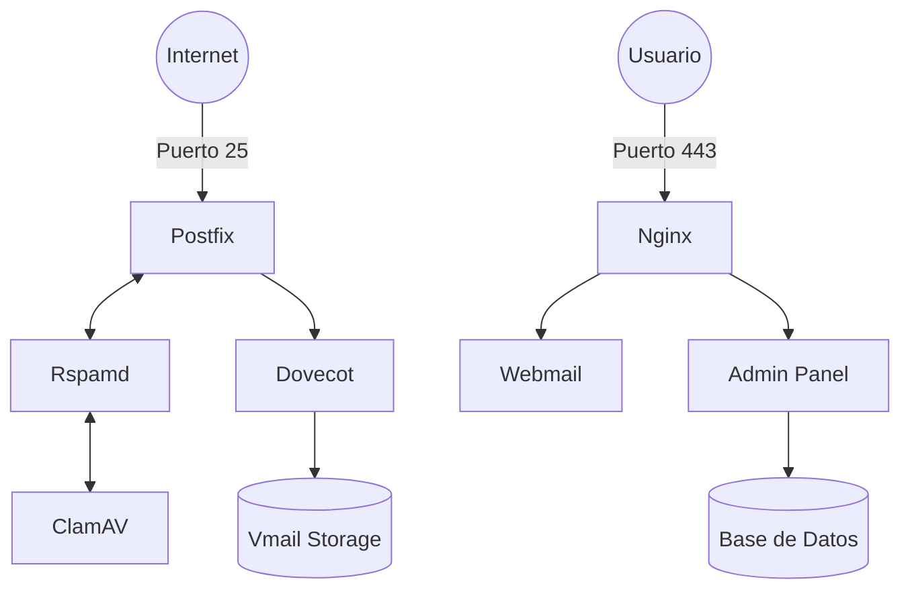

# Resumen Ejecutivo: Despliegue y Optimización de Mailcow-Gov

Este documento es una memoria técnica completa que consolida todas las acciones, configuraciones y la arquitectura detallada del servidor de correo `mail.example.com`.

---

## 1. Bitácora de Hitos del Proyecto

### 1.1 Fase de Inicialización y Configuración Base
- **Infraestructura:** Despliegue de Mailcow Dockerizado en una instancia macOS con Docker Desktop.
- **Configuración de Dominio:** Vinculación del FQDN `mail.example.com`.
- **Certificados:** Implementación de certificados SSL automáticos mediante el contenedor ACME (Let's Encrypt).

### 1.2 Configuración de Salida (Smarthost / Relay)
Debido a las restricciones de IPs residenciales para el envío directo, se implementó un relay externo:
- **Proveedor:** **SMTP2GO**.
- **Configuración:** Integración en Postfix para que todo el tráfico de salida sea autenticado y entregado de forma segura.
- **Validación:** SPF, DKIM y DMARC configurados correctamente.

### 1.3 Migración de Red y Acceso Inbound
- **DNS:** Actualización automatizada mediante API de Cloudflare (Nueva IP: `REPLACED_IP`).
- **Network:** Activación de **DMZ** en el router para puertos 25, 80 y 443.

### 1.4 Optimización de Anti-Spam (Rspamd)
- **Ham Rule:** Bono de **-20.0 puntos** para el dominio gubernamental.
- **Thresholds:** Límite de "Junk" elevado a **30.0 puntos**.
- **Neutralización:** Pesos de `R_SPF_FAIL` y `RDNS_NONE` ajustados a **0**.

---

## 2. Arquitectura Detallada de Contenedores

El stack de Mailcow se compone de los siguientes servicios interconectados:

| Contenedor | Función Principal | Descripción Detallada |
| :--- | :--- | :--- |
| **nginx-mailcow** | Terminal Web / Proxy | Punto de entrada HTTPS (443). Sirve el Panel de Control, SOGo y maneja el reverse proxy hacia los demás servicios. |
| **postfix-mailcow** | Agente de Correo (MTA) | El motor de envío y recepción. Gestiona la cola de correos y la conexión con el Smarthost (SMTP2GO). |
| **dovecot-mailcow** | Servidor IMAP/POP3 | Gestiona el acceso de los clientes (Outlook/Móvil) y el almacenamiento físico de los mensajes en disco. |
| **rspamd-mailcow** | Filtro Anti-Spam | Motor de análisis estadístico y de reglas que decide si un correo es legítimo o basura. |
| **sogo-mailcow** | Webmail y Groupware | Proporciona la interfaz web para usuarios, incluyendo correo, calendario y gestión de contactos. |
| **mysql-mailcow** | Base de Datos (MariaDB) | El corazón de los metadatos: usuarios, dominios, cuotas, alias y configuraciones del panel. |
| **redis-mailcow** | Caché y Almacenamiento | Guarda estados temporales, reputación de Rspamd y datos de control para el limitador de tráfico. |
| **acme-mailcow** | Gestor de SSL | Automatiza la obtención y renovación de certificados Let's Encrypt mediante desafíos HTTP/DNS. |
| **unbound-mailcow** | Resolver DNS | Servidor recursivo DNS con validación DNSSEC para asegurar que las consultas de Mailcow sean seguras. |
| **clamd-mailcow** | Antivirus | Escáner de seguridad que analiza todos los correos entrantes y salientes en busca de malware. |
| **php-fpm-mailcow** | Motor de Aplicación | Ejecuta el backend del Panel de Administración de Mailcow. |
| **netfilter-mailcow** | IPS (Sistema de Prevención de Intrusos) | Monitorea logs para bloquear IPs que intentan ataques de fuerza bruta (fail2ban). |
| **watchdog-mailcow** | Monitor de Salud | Supervisa la salud de los contenedores y los reinicia automáticamente si detecta fallas críticas. |
| **olefy-mailcow** | Escáner Office | Extrae y analiza macros y scripts dentro de documentos de Office adjuntos. |
| **ofelia-mailcow** | Programador de Tareas | Gestiona los trabajos recurrentes del sistema (cron interno de Docker). |

### 2.1 Diagrama de Flujo

---

## 3. Resguardo y Recuperación de Información

### 3.1 Datos Críticos (Volúmenes)
| Volumen | Importancia | Acción de Respaldo Externa |
| :--- | :--- | :--- |
| **vmail-vol-1** | **CRÍTICO** | Respaldo del directorio `/var/vmail`. Contiene los emails. |
| **mysql-vol-1** | **CRÍTICO** | Dump de SQL o copia de volumen en frío. Contiene las cuentas. |
| **crypt-vol-1** | **VITAL** | Claves de cifrado. Sin esto, los emails en vmail son ilegibles. |
| **mailcow.conf** | **VITAL** | Archivo de configuración raíz. Debe guardarse por separado. |

### 3.2 Script de Respaldo Oficial
Ubicación: `./helper-scripts/backup_and_restore.sh`
- **Comando:** `MAILCOW_BACKUP_LOCATION=/ruta/backup ./helper-scripts/backup_and_restore.sh backup all`

---
**Estado Final: OPERATIVO_PROD**
**Documento Generado: 2026-03-15**
